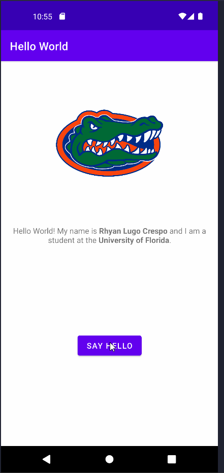

# Android Prework - *Introductory App*

Submitted by: **Rhyan Lugo Crespo**

**Introductory App** is an android app that shows an image and introductory message, and allows pressing a button to display a Toast. 

Time spent: **1.5** hours spent in total

## Required Features

The following **required** functionality is completed:

* [x] Image and introductory message displayed on screen
* [x] Button displayed on screen
* [x] Toast with message appears when button is pressed 

The following **optional** features are implemented:

* [x] List anything else that you can get done to improve the app functionality!
    * Added a rotation animation to the image after a button press.
    * Changed name and university names to be bolded in the introductory sentence.

## Video Walkthrough

Here's a walkthrough of implemented features:

GIF created with [LiceCap](http://www.cockos.com/licecap/).

## Notes

Describe any challenges encountered while building the app.
* I spent about 15 or so minutes researching and implementing the rotation animation for the image on a button press. Was relatively simple since I just used the toast line as an example of how to cause an event once the button was pressed. 

## License

    Copyright [2022] [Rhyan Lugo Crespo]

    Licensed under the Apache License, Version 2.0 (the "License");
    you may not use this file except in compliance with the License.
    You may obtain a copy of the License at

        http://www.apache.org/licenses/LICENSE-2.0

    Unless required by applicable law or agreed to in writing, software
    distributed under the License is distributed on an "AS IS" BASIS,
    WITHOUT WARRANTIES OR CONDITIONS OF ANY KIND, either express or implied.
    See the License for the specific language governing permissions and
    limitations under the License.
